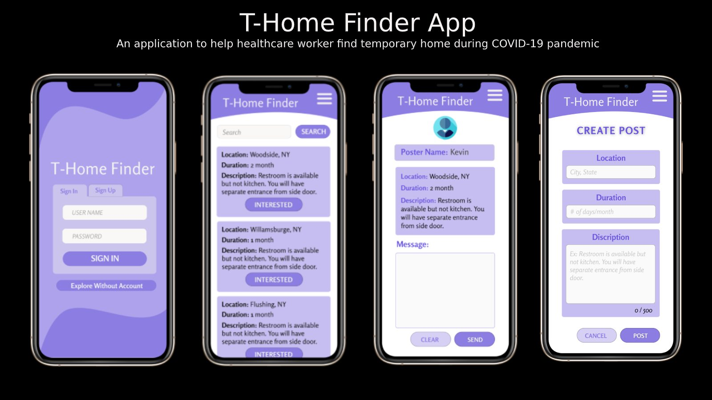

# What is T-Home-Finder

- During the time of war, a citizen needs to support all the army and marine but during the pandemic, all the citizens need to support our health care worker including those who are testing or creating a vaccine. COVIC-19 duration, no one is ready to handle this much pressure or situation and health care worker are working beyond their schedule and some health care worker need to stay separate from their family, this app is to find a temporary home for those healthcare workers by connecting people who can provide housing for any healthcare.

# Demo: Figma
- https://www.figma.com/file/27GcLrRULfp3KBGmh8ivdU/T-Home-App?node-id=0%3A1

# How T-Home-Finder Work
- House owner or helper post home with description and location and healthcare worker can contact helper for help.

# T-Home-Finder Tech Stack
- So far the project is an idea but it will be built using React Native as frontend and Ruby on Rails as a backend

# Challenge
- Lots of ideas came across by I need to prioritize with most needs for healthcare workers and housing comes first.

# What I have learned
- I learned that powerful action can be done using a simple design. This application uses just text/messages with no personal information and connects two people to solve a big problem

# Next Step For T-Home-Finder
- Implement or convert the design into code 

